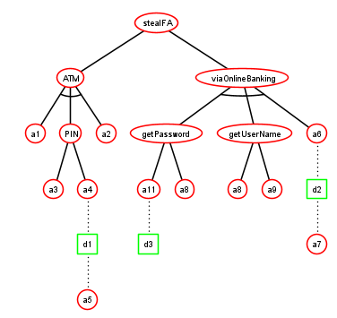
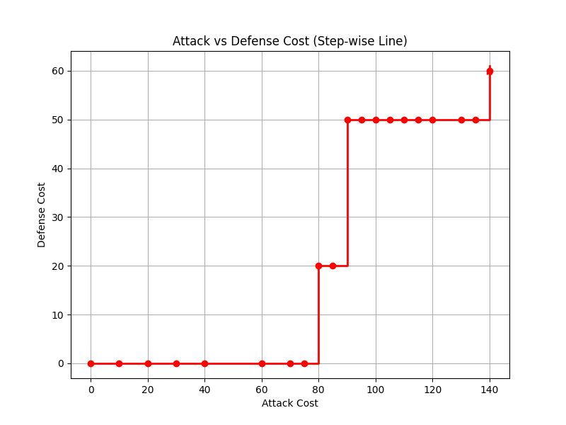

# 🛡️ ADTransformer

**A tool for security analysis of Attack-Defence Trees via model checking and trade-off exploration**

---

## 📌 Description

**ADTransformer** is a hybrid toolchain for the formal analysis of **Attack-Defence Trees (ADTs)**.  
Its main goal is to support **automated reasoning about trade-offs** between attacker and defender strategies using **multi-objective analysis**.

The tool takes as input an XML model generated by [**ADTool**](https://satoss.uni.lu/members/piotr/adtool/), parses it into an intermediate representation, and then **translates the ADT into a PRISM model** for analysis via probabilistic model checking.

Optionally, ADTransformer can **automatically generate the Pareto front**, providing a visual and computational representation of trade-offs between conflicting attacker/defender objectives.

---

## 🛠️ Tool Design

Our tool follows a modular pipeline architecture, where each component plays a specific role in transforming an **ADTool XML** file into a verified **PRISM model** and producing **Pareto-optimal trade-offs**.

### 📐 Architecture Overview

.png)  
*Figure 1: High-level architecture of the tool*

---

### 🧩 Modules

#### 🔍 Parser
> This module processes the input **XML file** from ADTool and builds an **internal tree structure** representing the Attack–Defense Tree (ADT).

#### 🔄 Adapter
> Converts the parsed ADT structure into a format suitable for **PRISM model generation**.

#### 🏗️ PRISM Code Generator
> Generates the **formal PRISM model** based on the adapted structure, ready for verification by the PRISM model checker.

#### ⚙️ PRISM Runner
> Invokes the **PRISM model checker** with the generated model and specified properties.  
> Outputs the results to a `data.csv` file, which contains points on the **Pareto Front**.

#### 📊 Pareto Builder
> Parses the `data.csv` file and uses a **Python script** to create a visual representation of trade-offs between different security and performance attributes.

---

### 🔄 Data Flow Diagram

.png)  
*Figure 2: Data flow from ADTool XML to Pareto trade-off visualization*

---

### 🧠 Summary

| Module            | Input                  | Output                 | Purpose                               |
|------------------|------------------------|------------------------|---------------------------------------|
| Parser           | `adt.xml`              | Internal ADT tree      | Load & parse ADTool tree              |
| Adapter          | Parsed tree            | Adapted structure      | Transform for PRISM compatibility     |
| Code Generator   | Adapted structure      | `model.prism`          | Generate PRISM model code             |
| PRISM Runner     | `model.prism`, props   | `data.csv`             | Run model checker & export results    |
| Pareto Builder   | `data.csv`             | Pareto chart (image)   | Visualize trade-offs                  |

---

## 🧠 Key Features

- 🔄 **ADTool XML to PRISM** model transformation
- 🧮 **Multi-objective analysis** with PRISM model checker
- 📈 **Automatic Pareto Front generation**
- 🧩 Support for different attacker/defender cost and success metrics
- 🎯 Enables formal reasoning about **attack feasibility**, **defence cost**, and **security trade-offs**

---

## ⚙️ Tech Stack

| Component         | Description                              |
|------------------|------------------------------------------|
| `.NET (C#)`       | ADTool XML parser and PRISM generator    |
| `Python`         | Pareto Front generation and visualization |
| `PRISM`          | Probabilistic model checker backend       |

---

📊 Example Output
✅ Transformed PRISM model (MDP or DTMC)

🧾 Rewards or costs defined for attacker/defender actions

📉 Pareto front of cost vs. success probability

📊 CSV file with raw results for post-analysis

*Example Model:*

*Pareto Front:*

[**Generated PRISM code**](GeneratedSamples/generatedSample.prism)

---

🎯 Goals
ADTransformer is designed to:

Assist researchers and engineers in formally evaluating ADTs

Enable quantitative analysis of attacker/defender interaction

Automate the bridge between graphical modeling and formal verification

Support decision-making under uncertainty and conflicting objectives
